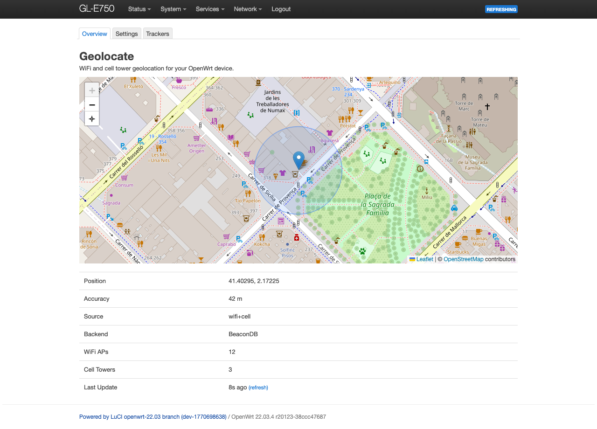
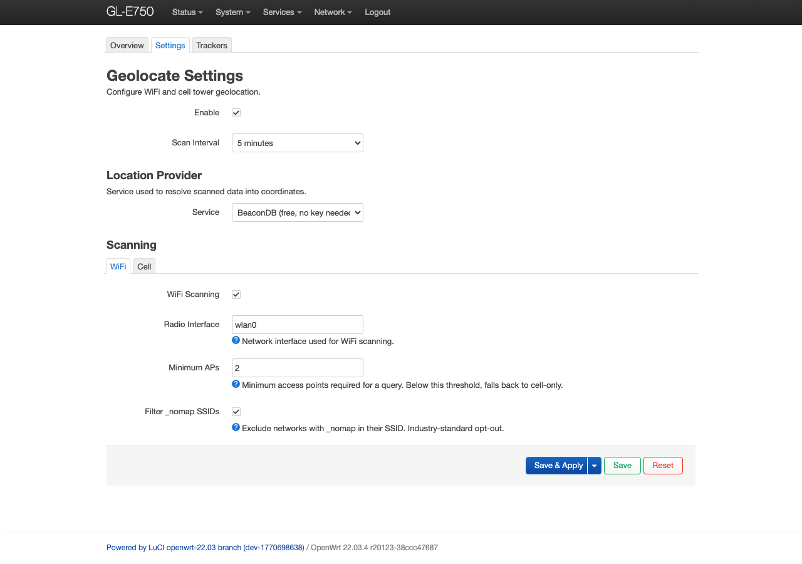
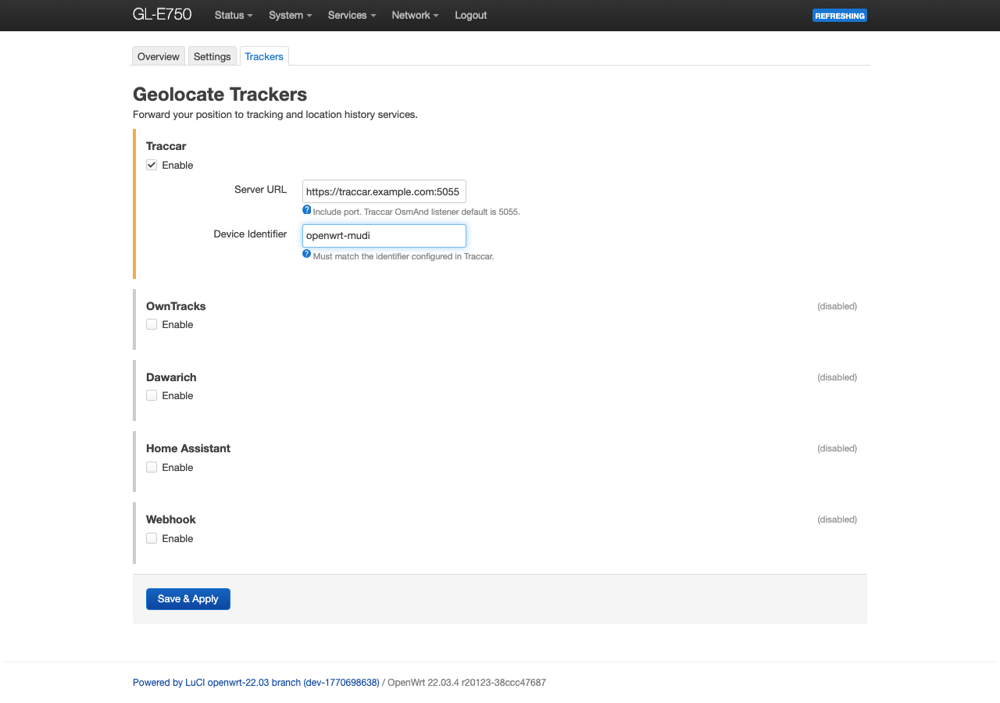

# geolocate - WiFi/Cell Geolocation for OpenWrt

[](https://github.com/francesco-carrella/openwrt-geolocate/releases/latest)
[](https://github.com/francesco-carrella/openwrt-geolocate/actions/workflows/ci.yml)
[](LICENSE)

Know where your router is — geolocation for OpenWrt.

`geolocate` determines your OpenWrt router's geographic position by scanning nearby WiFi access points and cell towers, then resolving them through a geolocation API. It works out of the box with [BeaconDB](https://beacondb.net) (free, no API key) and can forward your position to self-hosted tracking platforms.

## Features

- **Zero-config** — Works out of the box with BeaconDB (no API key). For better accuracy, Google Geolocation's free tier is recommended — see [Location Providers](#location-providers).
- **WiFi + Cell** — Scans access points and cell towers, combines both automatically.
- **Multiple providers** — BeaconDB, Google, Unwired Labs, or any MLS-compatible endpoint.
- **Location history** — Forward position to Traccar, OwnTracks, Dawarich, Home Assistant, or webhook.
- **LuCI web interface** — Live map, settings, and tracker configuration with health status.
- **Privacy-first** — No telemetry. Only BSSIDs and signal data are sent to providers — no SSIDs, no device identity. `_nomap` networks and randomized MACs are filtered automatically.

## Installation

### Option A: opkg feed (recommended)

```sh
# Add the feed (one-time)
echo "src/gz geolocate https://francesco-carrella.github.io/openwrt-geolocate" \
  >> /etc/opkg/customfeeds.conf

# Install
opkg update
opkg install geolocate luci-app-geolocate
/etc/init.d/geolocate enable
/etc/init.d/geolocate restart
/etc/init.d/rpcd reload
```

### Option B: manual download

Download both `.ipk` files from the [latest release](../../releases/latest), then:

```sh
scp -O *geolocate*_all.ipk root@192.168.1.1:/tmp/
ssh root@192.168.1.1 "
  opkg install /tmp/geolocate_*_all.ipk
  opkg install /tmp/luci-app-geolocate_*_all.ipk
  /etc/init.d/geolocate enable
  /etc/init.d/geolocate restart
  /etc/init.d/rpcd reload
  rm -f /tmp/*geolocate*_all.ipk
"
```

**Requirements:** OpenWrt 22.03+, `curl`, `jsonfilter`, `rpcd`, `iwinfo`, `luci-lib-jsonc`, `lua`

## Usage

Navigate to **Services > Geolocate** in LuCI:

**Overview** — Live map, position, accuracy, source
<a href="docs/screenshots/overview.png"></a>

**Settings** — Location provider, scan interval, WiFi/cell config
<a href="docs/screenshots/settings.png"></a>

**Trackers** — Enable/configure position forwarding
<a href="docs/screenshots/trackers.png"></a>

Or from the command line:

```sh
ubus call geolocate info           # Current position
ubus call geolocate scan           # Trigger immediate scan
ubus call geolocate output_status  # Tracker health
```

## Location Providers

BeaconDB requires no setup but coverage is uneven — results can be inaccurate in less-covered areas. For reliable everyday use, **Google Geolocation is recommended**. Its free tier (~10k requests/month) is enough for one request every 5 minutes, 24/7.

| Provider               | API Key    | Notes                               |
| ---------------------- | ---------- | ----------------------------------- |
| **BeaconDB**           | Not needed | Default. Free, open-source          |
| **Google Geolocation** | Required   | Most accurate. Free tier: ~10k req/month |
| **Unwired Labs**       | Required   | Freemium tier                       |
| **Custom endpoint**    | Optional   | Any MLS-compatible API              |

## Location History Trackers

| Tracker            | Protocol              | Auth                      |
| ------------------ | --------------------- | ------------------------- |
| **Traccar**        | OsmAnd (HTTP GET)     | Device ID                 |
| **OwnTracks**      | HTTP POST to Recorder | Basic Auth                |
| **Dawarich**       | OwnTracks-compatible  | API Key                   |
| **Home Assistant** | mobile_app webhook    | Access Token → webhook ID |
| **Webhook**        | Generic POST/PUT      | Custom header             |

## Cell Modem Support

The daemon auto-detects whichever modem tool is installed:

| Tool             | Modems                    | Notes                    |
| ---------------- | ------------------------- | ------------------------ |
| `gl_modem`       | GL.iNet devices           | AT commands via serial   |
| `mmcli`          | QMI, MBIM, AT (any modem) | Requires ModemManager    |

No modem tools are required — WiFi-only geolocation works without any cell hardware.

## Compatibility

Tested areas where reports on other hardware would be useful:

- **WiFi drivers** — ath9k confirmed, ath10k/mt76/others should work but are untested
- **Cell modems** — mmcli support is implemented but only tested via gl_modem (GL.iNet)
- **Tracker integrations** — OwnTracks, Dawarich, and Home Assistant are implemented per docs but untested against live servers
- **OpenWrt versions** — Tested on 22.03, should work on 23.05+

Tried it on your hardware? [Let us know how it goes](https://github.com/francesco-carrella/openwrt-geolocate/discussions/1), or directly PR your addition to the table below.

### Tested Hardware

| Device                     | OpenWrt | WiFi  | Cell                       | Status  |
| -------------------------- | ------- | ----- | -------------------------- | ------- |
| GL.iNet GL-E750 (Mudi V2) | 22.03.4 | ath9k | Quectel EP06 (gl_modem AT) | Working |

*Your device here? ^*

## License

GPL-2.0
